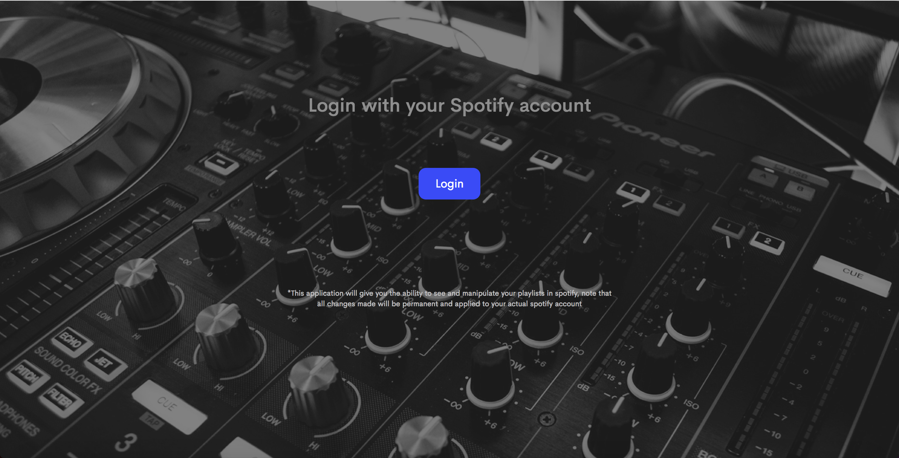
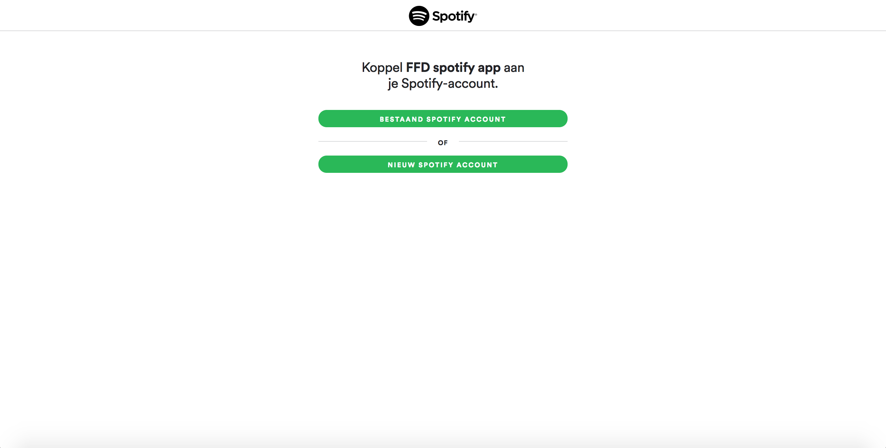
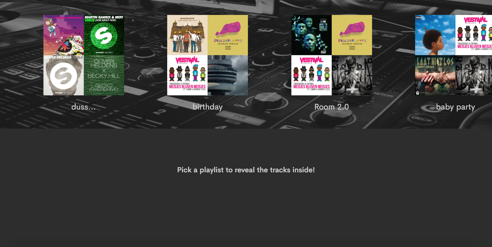
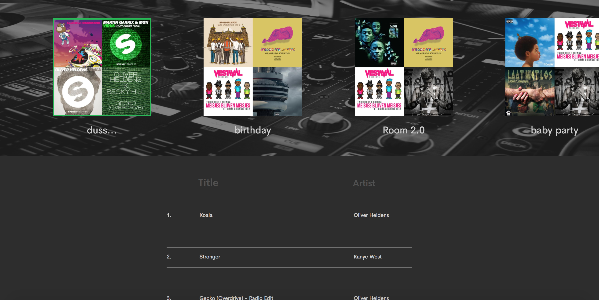
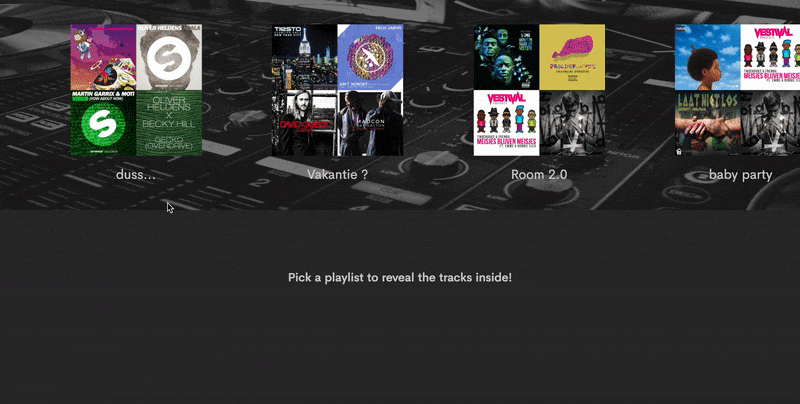

# Frontend For Designers - Assignment 3

In this readme you can read information about my last assignment for FFD.
The assignment consists of a web app (desktop) that shows data gathered from the spotify API.
The user can login with their own spotify account and see their personal playlists and songs.

**Important, for this to work on your computer you need node**

**- copy all files from github**

**- navigate to the main folder trough the terminal (on mac you can use "cd")**

**- install (npm install)**

**You should have a extra folder now with node modules**

Name: Jimmy de Kroon
StudNr: 500716228
Teacher: Koop Reynders



## What can the user do?

The user can choose how they want to login:
- With an existing spotify account
- Create a new spotify account
- Login with a facebook account



After the user is logged in the api will request the playlists from their account and show them on the top of the screen



The user can then click one of the playlists to show the tracks inside that specific playlist
The selected playlist is indicated by a green border



## UI interactions & animations

All playlists will be shown horizontally, the user can scroll trough their playlists to find the one they are looking for (if the user has enough playlists)


### Principles of User Interface Design
For this assignment we need to make sure we follow 3 of the 19 principles of UI design. [link to principles!](http://bokardo.com/principles-of-user-interface-design/)

#### 04. Keep users in control
      > Humans are most comfortable when they feel in control of themselves and their environment. Thoughtless software takes away that comfort by forcing people into unplanned interactions, confusing pathways, and surprising outcomes. Keep users in control by regularly surfacing system status, by describing causation (if you do this that will happen) and by giving insight into what to expect at every turn. Don't worry about stating the obvious…the obvious almost never is.

In the above gif you can see how the interface behaves during the selection of a playlist.
Before the user selected anything there will be a text on screen telling the user what to do ("pick a playlist to show what is inside").

After picking a playlist the tracks inside the chosen playlist will appear. The user can then see wich playlist they have selected (green border). From here the user can choose another playlist to change the tracks, the user will always see where he is working and will be in control of the app.



#### 09. Appearance follows behavior
      > Humans are most comfortable with things that behave the way we expect. Other people, animals, objects, software. When someone or something behaves consistently with our expectations we feel like we have a good relationship with it. To that end designed elements should look like how they behave. Form follows function. In practice this means that someone should be able to predict how an interface element will behave merely by looking at it. If it looks like a button it should act like a button. Don't get cute with the basics of interaction…keep your creativity for higher order concerns.

The playlists are buttons, but this is not really clear enough. That's why there is a text when there is no playlist selected. After a click on a playlist it will actually behave as a button, because now it is selected (green border).
The user now understands how the app works so the text is not needed anymore

#### 11. Strong visual hierarchies work best
      > A strong visual hierarchy is achieved when there is a clear viewing order to the visual elements on a screen. That is, when users view the same items in the same order every time. Weak visual hierarchies give little clue about where to rest one's gaze and end up feeling cluttered and confusing. In environments of great change it is hard to maintain a strong visual hierarchy because visual weight is relative: when everything is bold, nothing is bold. Should a single visually heavy element be added to a screen, the designer may need to reset the visual weight of all elements to once again achieve a strong hierarchy. Most people don't notice visual hierarchy but it is one of the easiest ways to strengthen (or weaken) a design.


The playlist buttons are the most important interactive elements on the page, that's why they are bigger than the other elements. After picking a playlist (and scrolling through the tracks) the playlist buttons aren't as important anymore. That's why the entire bar with playlist becomes smaller after scrolling, the visual hierarchy changes as the user goes trough the app.

Going back to "keep users in control":

The user can still change playlists by clicking on them after scrolling down, the buttons are just smaller.

## Interesting bits of code

The base of the app is build around the API data, so the API request is one of the most important functions.
The request checks for errors, if there are none a request is send to the spotify servers. Spotify API will only respond in this case if there is a valid access token (acquired by logging in) because we are requesting personal information. after the request is succesful we can work with the data the API send us, we start writing code in the succes: function()
```javascript
if (error) {
  alert('There was an error during the authentication');
} else {
  if (access_token) {
    $.ajax({
        url: 'https://api.spotify.com/v1/me/playlists',
        headers: {
          'Authorization': 'Bearer ' + access_token
        },
        success: function(response) {
          document.getElementsByTagName('body')[0].style.backgroundSize = "100% 450px";
          document.getElementsByTagName('h2')[0].style.display = "block";
          //console.log(response.items);
          for(var i = 0; i < response.items.length; i++){

            var showPlaylist = $('#playlists').append(function(){
              return $("<li data-id='"+response.items[i].tracks.href+"' style='margin-bottom:35px; list-style:none; color:#CECECE; '>" + "<div class='litext'>" + "<p>" + response.items[i].name + "</p>" + "</div>" + "</li>").click(clickedFunction)
            })

          }
        }
    });

  } else {
      // render initial screen
      $('#login').show();
      $('#loggedin').hide();
  }
}
```

After the for loop the playlists are appended (var showplaylist)

Clicking on one of the playlists calls the clickedFunction, this function appends the tracks and some other things.

``` javascript
for (var i = 0; i < response.items.length; i++) {

  var showTracks = $('#tracks').append(function(){
    return $("<div class='trackline'>" + [i+1]+"." + "<div class='tracklinename'>" + "<p>" + response.items[i].track.name + "</p>" + "</div>" + " " + "<div class='tracklineartist'>" + "<p>" + response.items[i].track.artists[0].name + "</p>" + "</div>" + "</div>" + "<br>")

  })
}
```

In order to make the playlists smaller when scrolling we use the following code:

``` javascript
var playlists = document.querySelector('#playlists');
var sticky = playlists.offsetTop;
```

If the user is scrolling the function stickyheader is called

``` javascript
window.onscroll = function() {stickyheader()};
```

Inside stickyheader is a lot of different stuff but the most important one is:
``` javascript
function stickyheader() {
  if (window.pageYOffset >= sticky + 105) {
    //console.log(window.pageYOffset)
    playlists.classList.add("sticky")
  }
}

  else {
    playlists.classList.remove("sticky")
}
```

This code adds or removes the css class "sticky" while scrolling, sticky makes the content stick on the screen (fixed) and makes the items smaller.

## Sources

[Spotify Api information](https://developer.spotify.com/web-api/)
[More spotify Api information](https://beta.developer.spotify.com/documentation/)

[Pexels stock photo's (free)](https://www.pexels.com/)

[w3schools.com](https://www.w3schools.com/)
[Stackoverflow.com](https://stackoverflow.com/)
